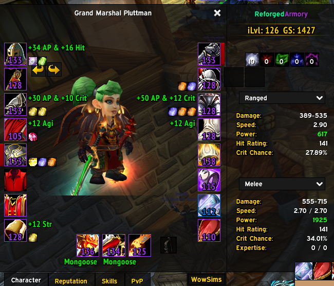
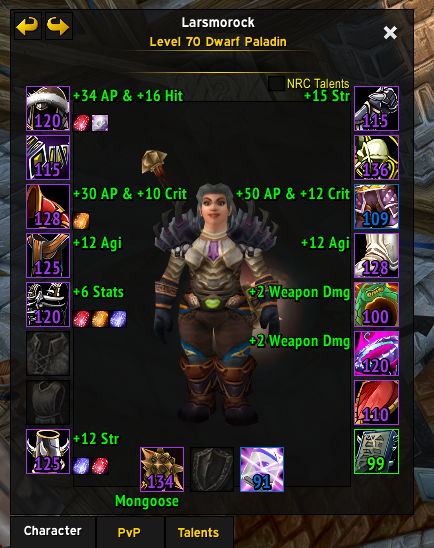

# ReforgedArmory-TBC

An ElvUI character and inspect-frame enhancement for WoW Classic Anniversary TBC.

## Features

- Item levels on equipped gear
- TacoTip-compatible GearScore totals
- Enchant and gem information
- Missing enchant and gem warnings
- Character durability indicators
- Expanded character statistics
- Character-title selector
- Support for inspecting other players

## Requirements

- WoW Classic Anniversary TBC
- ElvUI

## Installation

1. Download or clone this repository.
2. Place it in `World of Warcraft/_anniversary_/Interface/AddOns/`.
3. Ensure the addon folder is named `ReforgedArmory-TBC`.
4. Enable `ReforgedArmory-TBC` from the in-game AddOns menu.

## Screenshots

The screenshots are temporary and can be replaced with updated images using the same filenames.

## Issues

Report problems through the [GitHub issue tracker](https://github.com/luttman/ReforgedArmory-TBC/issues).

This project is a TBC-focused fork of ReforgedArmory.
